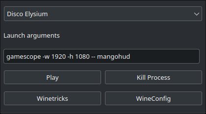

# NOTE

This is work in process and the application is not feature complete. Games can be launched and winetricks and winecfg can be used. The launcher use umu launchers config files and the launcher has a simple GUI for making those configuration files.

# What is this?



This is my simplistic Qt6 frontend for umu-launcher (previously named ULWGL) that can use Valves Proton to launch Windows game on Linux. The name is a subject to change.

This launcher is a hobby project and for personal use. You are free to expand or use the code however you want.

Umu-launcher needs to be installed on your system and must be in your path
https://github.com/Open-Wine-Components/umu-launcher
In the directory run
```shell
cd build
```
Then run Cmake
```shell
cmake ..
```
To make executable in the build directory
```shell
make
```
To install it to /.local/bin

```shell
make install
```
you are free to modify the install location if you want.


# TODO

One final thing for the launcher is fetch the correct game ID from the Umu database so that adding fixes for the games is fast and effortless.

https://github.com/Open-Wine-Components/umu-database
